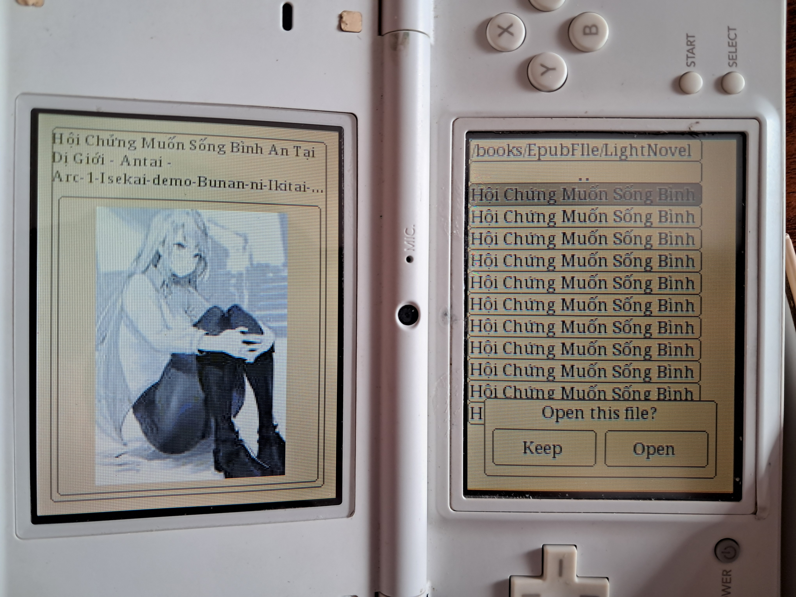
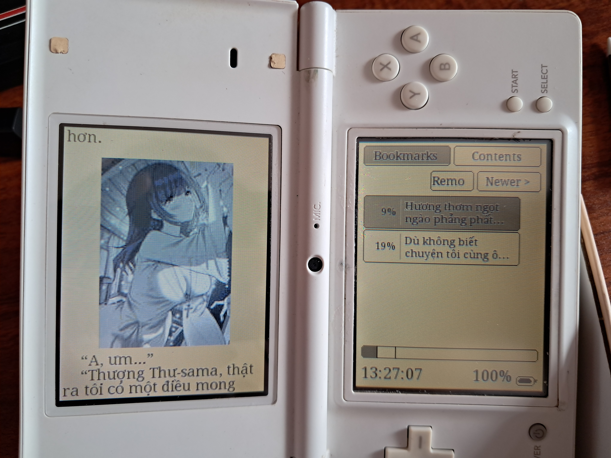
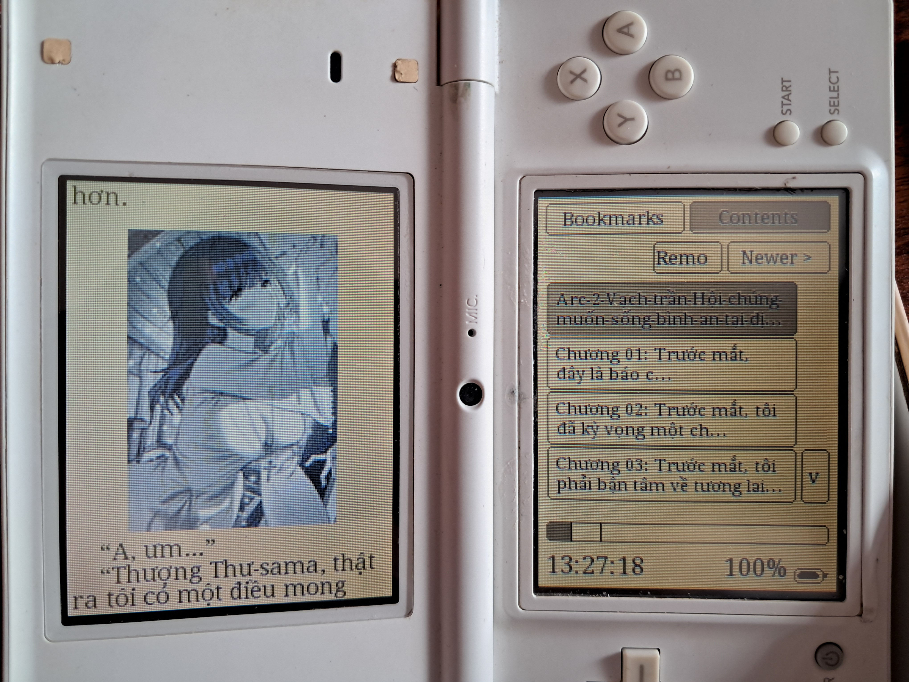

# IkuReader Modern EPUB Mod

This project is an EPUB-focused Nintendo DS/DSi build of IkuReader.

It is meant for reading `.epub` books, with support for JPEG images embedded in EPUB files.

## Features

- Reads `.epub` books on Nintendo DS and DSi
- Renders JPEG images inside EPUB files
- File browser with preview images
- Adjustable font, font size, line gap, indent, theme, gamma, layout, and screen usage
- Bookmarks, contents view, and in-book search

> [!WARNING]
> This build was not tested on original DS hardware by me yet. It works in my current setup, but some books or settings may still feel slow or crash on some devices.

## Performance Changes

This repo includes a few optimizations to reduce lag:

- File browser previews are delayed slightly instead of decoding immediately on every cursor move
- Recent previews are cached, so revisiting the same book is faster
- EPUB image decoding now reuses the opened archive and caches recent decoded images
- Reopening pages after some settings changes is smoother, especially in image-heavy books

## Screenshots

### DS / Emulator

- [File browser on DS emulator](images/ds/file_browser3.png)
- [Bookmarks on DS emulator](images/ds/bookmark1.png)
- [Contents on DS emulator](images/ds/content1.png)

### DSi

  
  
  

## Quick Start

1. Build the project with `make`.
2. Copy `sandbox/data/ikureader` to `/data/ikureader` on your flashcart or SD card.
3. Copy the generated ROM from `sandbox/`:
   - `IkuReader-6.5_modern.nds` for DS flashcarts
   - `IkuReader-6.5_modern.dsi` for DSi setups that use `.dsi`
4. Put your books anywhere you like. `/books/` is a good default and is checked first by the browser.
5. Launch the ROM and open an EPUB.

> [!NOTE]
> If you do not want to build from source, download the release package from [Releases](https://github.com/renatheoccupier/Epub-reader-for-ds/releases). Make sure the `data/ikureader` folder is copied to the root of your SD card or flashcart.
>
> If you want to add your own fonts, prepare 3 files:
> - `FontName.ttf` for regular text
> - `FontNameB.ttf` for bold text
> - `FontNameI.ttf` for italic text
>
> Example:
> - `DroidSerif.ttf`
> - `DroidSerifB.ttf`
> - `DroidSerifI.ttf`
>
> The helper scripts in `tools.zip`can also be useful for preparing large EPUB files (you can use `python3 <tool.py> --help` for more information and usage), i highly recommend using small epub hmm it best if small than 1mb (it can load up to 3mb file but make quite long time) oh and same with images in epub file adjust it to suit with ds, dsi screen and resolution(cause even you keep image in default it still look bad as fk in ds, dsi and make your device load it quite long :> )

## Controls

### File Browser

- D-pad Up/Down: move selection
- Right / `A`: open folder or preview a book
- Left / `Y`: go back to the parent folder, or leave the browser from `/`
- Touch: select entries
- In the open prompt:
  - Right / `A`: open the selected book
  - Left / `Y`: keep browsing

### Reading

- Right side tap, Right / `A`: next page
- Left side tap, Left / `Y`: previous page
- `R` / `L`: line-by-line scroll
- Up / `X`: bookmarks and contents
- Down / `B`: reading settings
- `Select`: search
- Swipe left/right: page turn

> [!NOTE]
> Touch controls work in the browser and while reading, so you can use the app without relying only on buttons.

## Build

Tested in this repo with:

- `make -C arm9`
- `make`

You need a working devkitPro / devkitARM setup with the Nintendo DS build tools available in your environment.

## Project Layout

- `arm9/source/`: main reader code
- `include/`: headers
- `sandbox/data/ikureader/`: runtime data to copy to the device
- `tools/`: helper scripts for EPUB preparation

## Credits

- [awkitsune](https://github.com/awkitsune) / Vladimir Kosickij for the modern IkuReader update this project builds on
- Chintoi for the original IkuReader codebase
- [renatheoccupier](https://github.com/renatheoccupier)

Reference sources for credit:

- `awkitsune/IkuReader`: <https://github.com/awkitsune/IkuReader>
- Original IkuReader release notes mentioning Chintoi: <https://www.dcemu.co.uk/content/88954-IkuReader-v0-043-0044?s=c71cd78a6fd5a633f9483b42687ad6ea>
